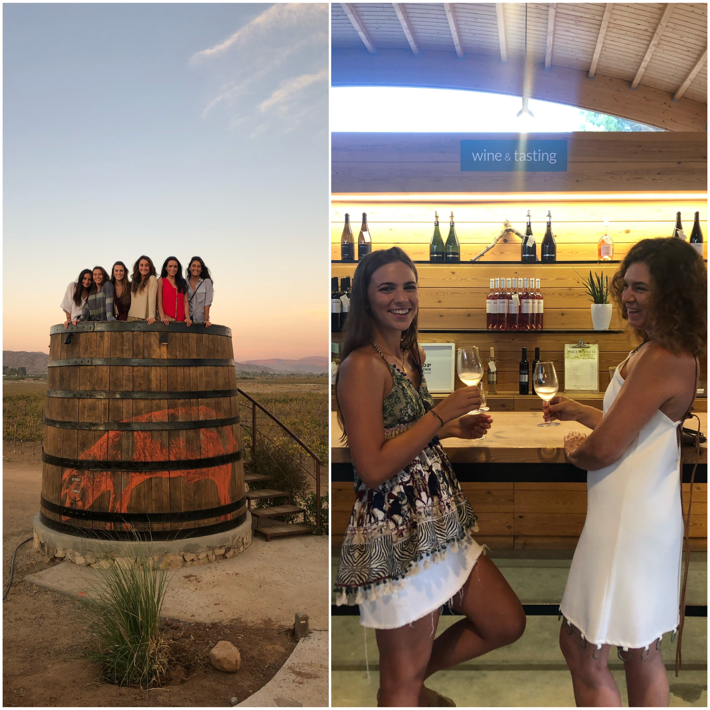
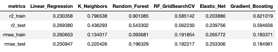
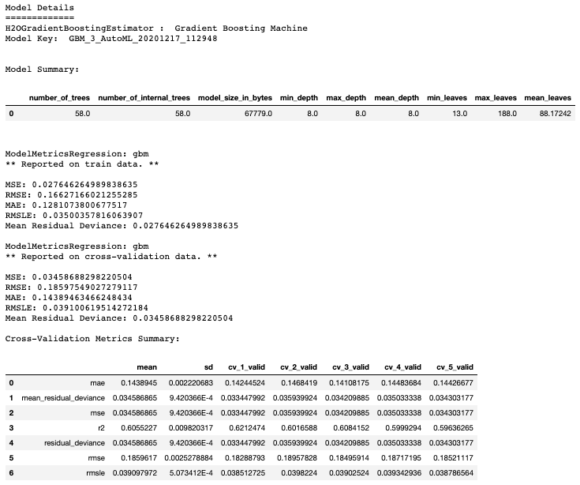
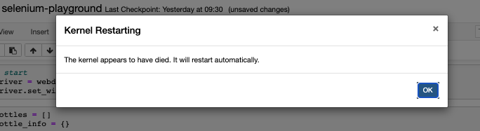
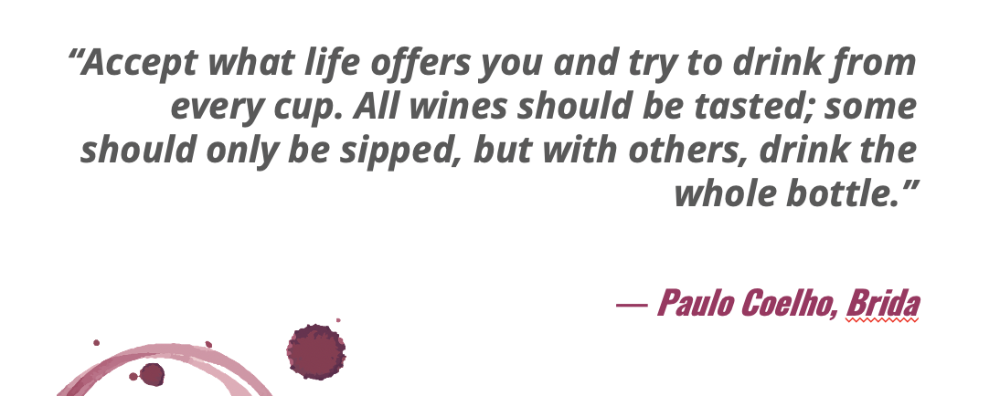

# WINE NOT?
## Ironhack's Data Analytics Bootcamp Final Project

The **purpose** of this final project is to put into practice the knowledge acquired through the 9-week bootcamp in a topic of our choice.

## Choosing a topic

I can't say I'm an expert in wines. But despite my lack of knowledge, I do consider myself a *wine-lover*. In fact, I have been to multiple wineries - Napa Valley, Valle de Guadalupe, Douro Valley, Binifadet in Menorca - where I've had the opportunity to go wine tasting. And let me tell you: it is fun. But again, I'm no expert. 

(On the left I'm visiting Valle de Guadalupe with my friends, and on the right I'm wine tasting in Binifadet with my mum).

Moreover, after watching [Disrupting Wine](https://www.imdb.com/title/tt12645184/) (a documentary about the founder of Vivino), I became very interested and curious about the wine industry. Which is why, for my final project, I decided to dive deeper and shed some light into this complex world, because **wine not**?

## Finding a dataset

This step is the most important in my opinion, and the one that took me the longest. Finding a good dataset with quality data is no easy task. So after doing a lot of research, I decided to opt for [this](https://www.kaggle.com/budnyak/wine-rating-and-price) dataset from Kaggle.

## Approach

The **main goal** of this project is to **predict the rating** of a bottle of wine given certain characteristics (see below), in order to help customers when buying wine. 

Characteristics:
- Country of origin
- Price
- Year of production
- Wine style (red, white, rose or sparkling)

## Tools

To do this, I have used multiple Supervised Machine Learning methods such as:

- Linear Regression Model
- K Neighbors Regression
- Random Forest Regressor
    - GridSearchCV
- Elastic Net (Lasso + Ridge)
- Gradient Boosting Regressor

Finally, I have decided to use **h2o** since it is the best tool for rapidly turning over models and finding the one that fits the best.

## Process

1. Exploratory Analysis
2. Modeling & training data
3. Choosing model that fits better
4. Drawing conclusions

## Results

These are the results from the models I have tried:

We can see that the most accurate model is the last one: **Gradient Boosting Regressor**, which is the one that was found by h2o.

Here is the model performance summary done by h2o:

## Final thoughts & Future Improvements

1. Optimize the model until it fits the data as best as possible
2. My *initial idea* was to enrich the dataset with Vivino's information, such as the wine taste attributes, the food that goes well with, the reviews... To do so, I used ``Selenium`` (a webscraping tool) to scrap all the information from Vivino. However, since the dataset contains a lot of data (13,834 bottles of wine to be exact), it was too much for my computer memory and the kernel would keep dying.

3. If I would have been able to scrap the reviews from Vivino, I would have liked to make a comparison between the reviews from the website (which are given by users who might or might not be experts in the field) and renowned sommelier's reviews. Sadly, this idea couldn't be executed in the time frame given, but it remains pending for the future.

## Last but not least
